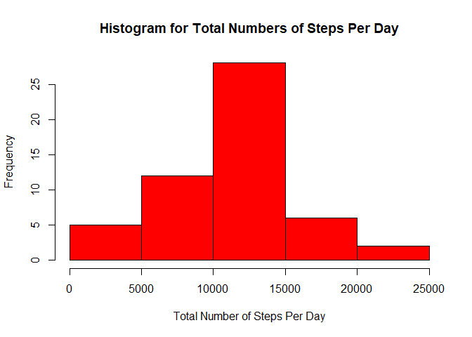
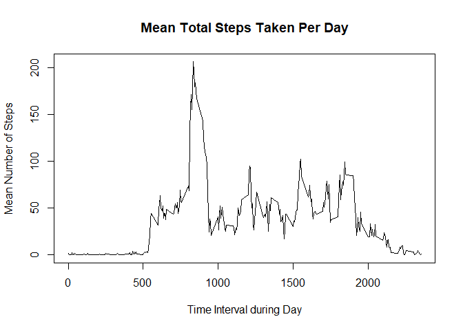
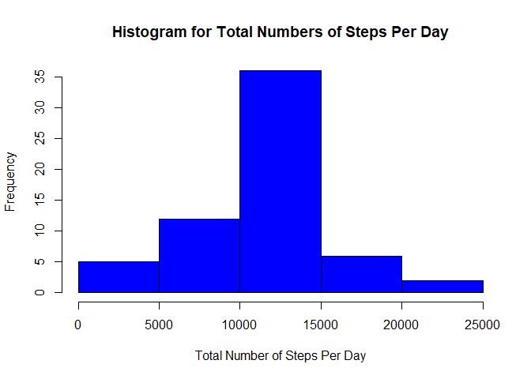
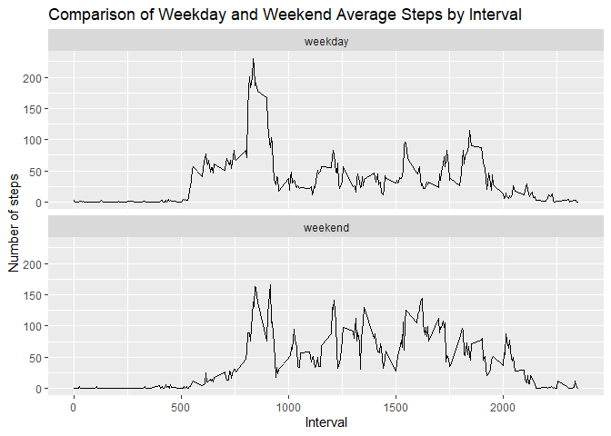

Load all the additional packages used in this code:


```r
library(ggplot2)
```

## Loading and preprocessing the data

Load the data:

```r
activity <- read.csv("activity.csv",head=TRUE)
```

Removed the NAs from the data:

```r
activity <- activity[!is.na(activity$steps),]
```

Example of the first few lines using *head()*:

```
##     steps       date interval
## 289     0 2012-10-02        0
## 290     0 2012-10-02        5
## 291     0 2012-10-02       10
## 292     0 2012-10-02       15
## 293     0 2012-10-02       20
## 294     0 2012-10-02       25
```

## What is mean total number of steps taken per day?

Group data by day and sum the total steps:

```r
activityByDaySum <- aggregate(activity$steps, by = list(activity$date), sum)
colnames(activityByDaySum) <- c("Date","SumSteps")
```

Create Histogram:

```r
hist(activityByDaySum$SumSteps,main="Histogram for Total Numbers of Steps Per Day",
     xlab = "Total Number of Steps Per Day", col="red")
```

<!-- -->

Calculate statistics (mean/median):

```r
mean1 <- mean(activityByDaySum$SumSteps)
median1 <- median(activityByDaySum$SumSteps)
```
The mean is **10766.19** and median is **10765** for the total number of steps taken per day.

## What is the average daily activity pattern?

Group data by interval and average the steps:

```r
activityByIntervalAvg <- aggregate(activity$steps, by = list(activity$interval), mean)
colnames(activityByIntervalAvg) <- c("Interval","AvgSteps")
```

Create plot:

```r
plot(activityByIntervalAvg$Interval,activityByIntervalAvg$AvgSteps, type="l",
     main="Mean Total Steps Taken Per Day",xlab="Time Interval during Day",
     ylab="Mean Number of Steps")
```

<!-- -->

Report interval for maximum steps:

```r
maxIntervalRow <- which.max(activityByIntervalAvg$AvgSteps)
maxInterval <- activityByIntervalAvg$Interval[maxIntervalRow]
```

The 5-minute interval which contains the maximum number of steps on average for the entire data set is **835**.

## Imputing missing values

Input Data and Count NAs:

```r
activity <- read.csv("activity.csv",head=TRUE)
activityNAs <- activity[is.na(activity$steps),]
missingValues <- nrow(activityNAs)
```

The total number of missing values in the dataset is **2304**.

Replace the missing step values with the mean for that 5-minute interval using a *for loop*:

```r
# replicate original data
activityNoNAs <- activity

for (i in 1:nrow(activityNoNAs)) {
  if (is.na(activityNoNAs$steps[i])) {
    activityNoNAs$steps[i] <- activityByIntervalAvg$AvgSteps[activityByIntervalAvg$Interval==activityNoNAs$interval[i]]
  }  
}
```

Example of the first few lines using *head()*:

```
##       steps       date interval
## 1 1.7169811 2012-10-01        0
## 2 0.3396226 2012-10-01        5
## 3 0.1320755 2012-10-01       10
## 4 0.1509434 2012-10-01       15
## 5 0.0754717 2012-10-01       20
## 6 2.0943396 2012-10-01       25
```

Group data with missing values replaced by day and sum the total steps:

```r
activityNoNAsByDaySum <- aggregate(activityNoNAs$steps, by = list(activityNoNAs$date), sum)
colnames(activityNoNAsByDaySum) <- c("Date","SumSteps")
```

Create new histogram with missing values replaced:

```r
hist(activityNoNAsByDaySum$SumSteps,main="Histogram for Total Numbers of Steps Per Day",
     xlab = "Total Number of Steps Per Day", col="blue")
```

<!-- -->

Calculate the new statistics (mean/median) with missing values replaced:

```r
mean2 <- mean(activityByDaySum$SumSteps)
median2 <- median(activityNoNAsByDaySum$SumSteps)
```

The mean is **10766.19** and median is **10766.19** for the total number of steps taken per day with the missing values replaced.

With the missing values replaced the mean remained the same at **10766.19**. However, the median values changed slightly from **10765** to **10766.19**.

## Are there differences in activity patterns between weekdays and weekends?

Create new data set to categorize the date as either *weekday* or *weekend*:

```r
weekday <- weekdays(as.Date(activityNoNAs$date))
weekday[weekday %in% c("Saturday","Sunday")] <- "weekend"
weekday[weekday != "weekend"] <- "weekday"
```

Set the new data set as a factor with two levels:

```r
weekday <- as.factor(weekday)
```

Add the new weekend data set to the full data set:

```r
activityNoNAs$weekday <- weekday
```

Group the steps variable by its interval along with its corresponding weekday:

```r
weekdayActivityByIntervalAvg <- aggregate(steps ~ interval + weekday, activityNoNAs, mean)
```

Example of the first few lines using *head()*:

```
##   interval weekday      steps
## 1        0 weekday 2.25115304
## 2        5 weekday 0.44528302
## 3       10 weekday 0.17316562
## 4       15 weekday 0.19790356
## 5       20 weekday 0.09895178
## 6       25 weekday 1.59035639
```

Plot the time series data comparing weekend versus weekday:

```r
qplot(interval, 
      steps, 
      data = weekdayActivityByIntervalAvg, 
      geom=c("line"),
      xlab = "Interval", 
      ylab = "Number of steps", 
      main = "Comparison of Weekday and Weekend Average Steps by Interval") +
  facet_wrap(~ weekday, ncol = 1)
```

<!-- -->

The time series data between weekday and weekend is very similar. There a slight increase of activity earlier in the day during the weekend between 500-750 intervals, likely due to exercising before work. The peak activity is around the same time period (~850) for both weekend and weekday, but the peak is higher for weekday. The activity is also generally higher throughout the day for weekend, likely due to individuals exercising during the day since they're off work. 
